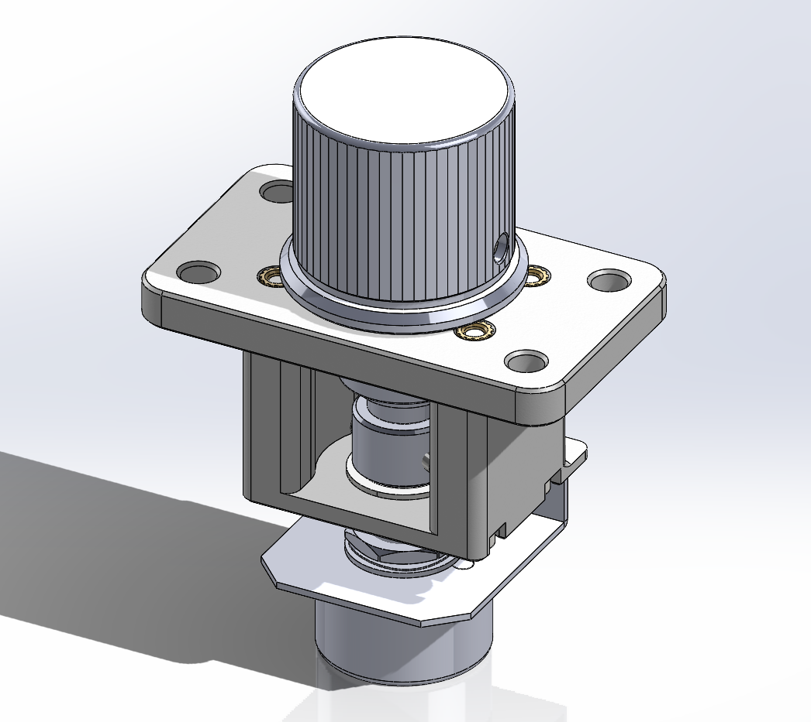

SDVX Nemsys Cab / SVRE9 knob bearing upgrade
==========================

This modifies the knob assembly from an original Nemsys SDVX cab, or an SVRE9 controller,
to use ball bearings, similar to Valkyrie Model. It reuses the original shaft, torque limiter, and
encoder bracket.

Bill of materials
-----------------

Linked parts are tested and working but parts are generic, others will likely be fine.
Quantities are for 2 knobs (1 pair). Linked parts have more than enough for several pairs.

- M3x30 socket head cap screw - `8 pcs` - [Amazon](https://a.co/d/0tDwU9o)
- 6x10x3mm flanged bearing (MF106-ZZ or MF106-2RS) - `2 pcs` - [Amazon](https://a.co/d/aINREZl)
- 8x14x4mm flanged bearing (MF148-ZZ or MF148-2RS) - `2 pcs` - [Amazon](https://a.co/d/gLa0Dsq)
- M3 hex nut, **OR** M3x5x4 (Voron) heat-set threaded insert - `4 pcs` - [McMaster-Carr](https://www.mcmaster.com/catalog/129/3725/94180A331)

Print settings
--------------

0.2mm layer height, 4 perimeters, 5 top/bottom solid layers, 40% infill.

Tested with ABS and PETG, but probably anything is fine.

Print settings and assembly steps are identical for both cab and SVRE9,
but please **ensure you are using the correct files/models.**

Assembly
--------

Required tools: 1.5mm, 2mm, and 2.5mm hex drivers

First, disassemble the original knob assembly, but keep the encoder mounted on
the bracket. Before assembling, check that the bearings fit over the shaft
without excessive force. You may need to sand down the shaft slightly to make
it fit.

1. Install the 4 hex nuts or threaded inserts into the top plate.
   Snap the bearings into the printed parts from the top side.
2. Slide the torque limiter onto the shaft, and the shaft into the top plate,
   fitting the torque limiter tabs into the top plate slot.
3. Put the spacer on the shaft, flat face up.
4. Put the knob on the shaft, pressing the whole stack together firmly to
   ensure the bearing and spacer are seated. Secure it with the set screws.
5. Use 4 M3x30 screws to attach the bottom part to the top plate.
6. Install the encoder with its bracket, and secure it with the set screws.

**Tip:** if the assembly is tight/hard to turn after assembly, loosen the set screws
holding the metal shaft to the encoder, pull the encoder slightly back (~0.5-1.0mm),
then re-tighten the set screws.

[Step by step images](Assembly_images.md)

Disclaimer
----------

Copyright 2023 Adrian Keet.

This source describes Open Hardware and is licensed under the CERN-OHL-W v2.

You may redistribute and modify this source and make products using it under
the terms of the CERN-OHL-W v2 (https://cern.ch/cern-ohl). This source is
distributed WITHOUT ANY EXPRESS OR IMPLIED WARRANTY, INCLUDING OF
MERCHANTABILITY, SATISFACTORY QUALITY AND FITNESS FOR A PARTICULAR PURPOSE.
Please see the CERN-OHL-W v2 for applicable conditions.
